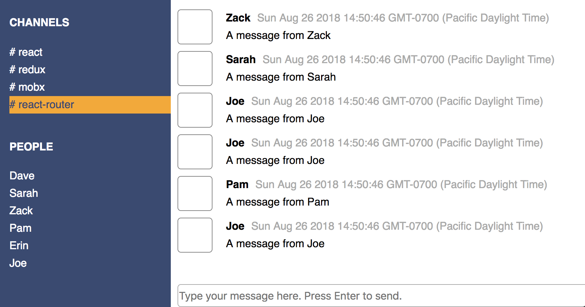

## Slack Project

This is a simple slack web app, built with ReactJS.

## App Functionality

Users will be able to 
- see a list of Channels and Users on the SideBar 
- click and select one Channel or User at a time
- check each Channel's or User's messages by selecting itmes on the SideBar
- type in the input box and hit ENTER to add the message to the selected Channel or User

## Project Screenshot 

## Installation Instructions

- git clone https://github.com/mavisluan/slack.git
- cd slack
- yarn install
- yarn start
